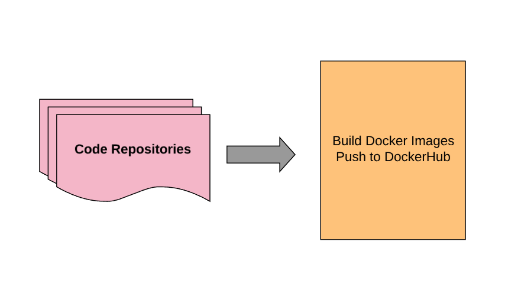
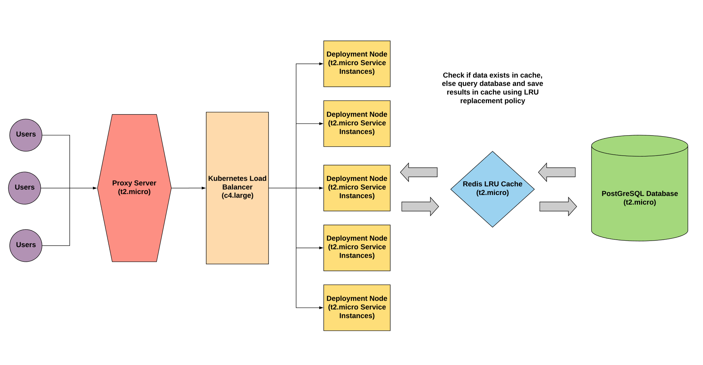

# Host-neighborhood description service
   

## Built with:

1. React
2. Express
3. PostGreSQL
4. Kubernetes
5. Redis Cache
6. Docker
7. AWS EC2, S3, Route 53
8. Service oriented architecture

## Tested with:

1. Loader.io

## Monitored with 

1. New Relic

## API:

Google Maps API (https://developers.google.com/maps/documentation/)

## API helpers:

npm: google-map-react (https://www.npmjs.com/package/google-map-react)

## System architecture:

## Getting Started:

To start the application:
1. Install dependencies: run ` npm i `
2. Start the server and build the bundle: run ` npm start `

To stop the application's server: 
 run ` npm stop `

## Integrating:

1. When in ssh, navigate to repository, outside main folder create a config file with the api key
2. Check if the axios requests go to absolute path :

- '/chat.jsx': get- and postMessages methods
- '/index.jsx': getHost method 

## Setting up database

Need to make sure that you're adding PostGreSQL Apt repository to ubuntu before you try to install. Even number versions are long term version (16.04 and 18.04) and are backwards compatible. Odd number versions (19.04) may not be backwards compatible and are more for testing of new features. But regardless, need to give access so in Ubuntu to postgresql website to be able to install:
https://askubuntu.com/questions/1088444/install-postgresql-9-4-on-ubuntu-18-04

Seed 10 million artificially generated records into database by running `node FeC/db/insertMillionPostGreSQL.js` 

You can also seed 10 million artificially generated records into mongo database by running `node FeC/db/insertMillionMongoCluster.js`, which seeds the database in parallel using the full number of processors on your machine. 

